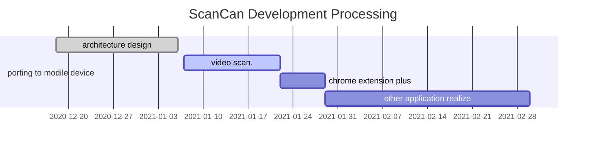

<b><i>告别二维码，同样能“扫一扫”！</i></b>

<h1>  ScanCan </h1>

扫一扫，告诉你想知道的全部

 

Demo: Parse information hidden in images

 

## ✨ 特性
- 多场景
- 兴趣社交
- 用户数据隐私
- 无网同传
- 深度3D场景融合
- [AR-DAO](https://github.com/Charmve/AR-DAO) DAO 去中心化

说明：

## 多场景

1. 扫 **花草树木**，识别各类植物的名称和详情，亲临大自然，不止“形色”。
2. 扫 **文物画作**，了解文华的博大精深，再次走进“文化传承、全民读书”的良好精神乐园。这对个人、社会和民族都有着十分重要的作用，然而当前市场还留有大片空白。
3. 扫 **变废为宝**，垃圾分类是一项长期推行的社会性行为，是每个人都必须养成的习惯。当前，在上海、苏州等地已经开始垃圾分类试行，3466.54万人正在开始进行垃圾分类，然后大量民众是不知道如何分类的。随着，垃圾分类的日益普及，越来愈多的人要加入到这项行动中来。通过 ScanCan 即可完成对任何一件物品的垃圾分类。
4. 扫特制图片 StageStamp, 扫出盲盒，给你惊喜。通过图像隐写术在图片中嵌入字符，检测识别出字符编码，带给你不一样的快乐。
5. 实现类似于ClipDrop的多平台图片素材提取，方便扫出的图像运用在你的工作中。

## 兴趣社交
ScanCan 能扫出很多有趣的事物，给好友分享，逐渐建立同类兴趣好友圈，找到那个和你很像的人。朋友不在多，只要有几个和你一样的人就够了。

## 用户数据隐私

- 全部扫一扫功能都在本地处理，用户数据不会上传到云端；
- 安全性：ScanCan 通过图像识别和隐写术的技术手段，避免传统二维码扫一扫识别方式的安全漏洞风险；

## 无网同传

- 在一些无网络场景下，依然可以实现“扫一扫”功能，因为识别模型在本地；
- 通过类似于 AirDrop 的无线传输方案，可通过**碰一碰**传输分享图片、消息等信息；

## AR Cut & Paste

https://user-images.githubusercontent.com/29084184/179511503-d887ea15-4010-47bb-b24f-f827713adc18.mp4

[**Check it out on web !**](https://clipdrop.co/remove-background)

## Mobile-NeRF

https://github.com/google-research/jax3d/tree/main/jax3d/projects/mobilenerf

[**Check it out on web !**](https://storage.googleapis.com/jax3d-public/projects/mobilenerf/mobilenerf_viewer_mac/zdeferred_ff_mac.html?obj=fern)

link:
- https://mobile-nerf.github.io/
- https://github.com/dunbar12138/DSNeRF
- https://github.com/kwea123/nerf_pl

## [AR-DAO](https://github.com/Charmve/AR-DAO)

让用户通过增强现实（AR）铸造NFT并参与不同游戏的去中心化自治组织。AR-DAO开源了视觉识别算法的代码框架并应用于各类增强现实场景。通过向智能合约传输加密后的（不可篡改性）场景数据，通过伪随机的生成NFT。它兼容区块链的EVM（Ethereum Virtual Machine）而可被智能合约运行在EVM兼容的区块链上来确保数据上的不可篡改。AR-DAO可以通过DAO组织化的管理来不断提升其性能和应用范围的升级，AR-DAO会不断深度学习，从而适应更多潜在的应用场景。

# 项目发起

即日起，寻找志同道合的开源爱好者开发此项目，先从微信小程序搭建起，有意者联系：yidazhang1@gmail.com 或 微信：Yida_Zhang2

## ☕ Processing

# Similar Projects

- StegaStamp-plus. https://github.com/Charmve/StegaStamp-plus
- Qrcp. https://github.com/claudiodangelis/qrcp
- ClipDrop. https://github.com/cyrildiagne/ar-cutpaste
- Signal. https://github.com/signalapp/Signal-iOS
- AirDrop. https://github.com/seemoo-lab/opendrop
- StegaStamp. https://github.com/tancik/StegaStamp
- consensys. https://www.consensys.net/
- UNISWAP. https://uniswap.org/
- Solidity starter (beta). https://replit.com/@replit/Solidity-starter-beta#examples/token.sol

 

## 📜 License

This work is licensed under the [Creative Commons Attribution NonCommercial ShareAlike 4.0 License](https://creativecommons.org/licenses/by-nc-sa/4.0/legalcode).

## 💝 Acknowledge

 

**让我们为热爱发电，为科普教育行动！**

 

